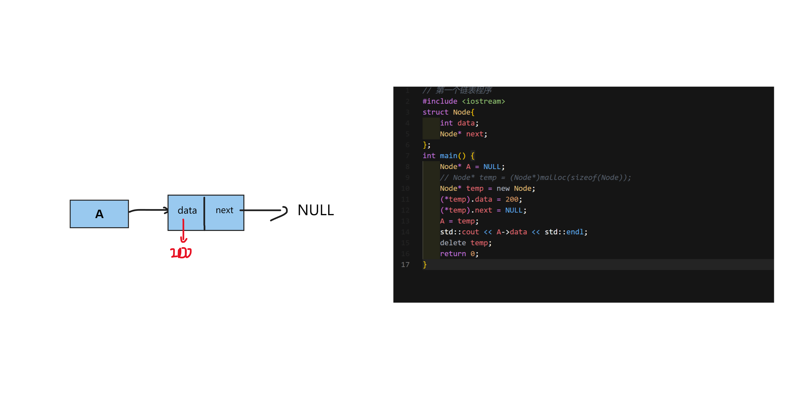
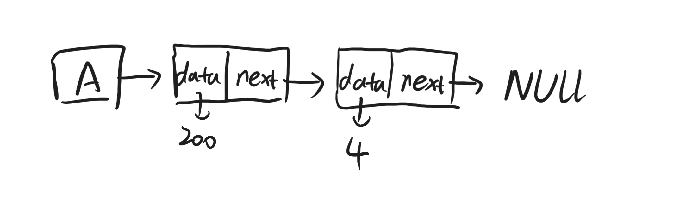

# 第一个链表程序
```cpp
// 第一个链表程序
#include <iostream>
struct Node{
    int data;
    Node* next;
};
int main() {
    Node* A = NULL;
    // Node* temp = (Node*)malloc(sizeof(Node));
    Node* temp = new Node();
    (*temp).data = 200;
    (*temp).next = NULL;
    A = temp;
    std::cout << A->data << std::endl;
    delete temp;
    return 0;
}
```



---

# 在链表中插入节点

## 在链表尾部插入节点
```cpp
#include <iostream>

// 定义一个结构体Node，表示链表的节点
struct Node
{
    int data;   // 存储节点的数据
    Node *next; // 指向下一个节点的指针
};

int main()
{
    Node *A = NULL;          // 定义一个指向链表头节点的指针，初始值为NULL
    Node *temp = new Node(); // 创建一个新的节点
    temp->data = 200;        // 设置新节点的数据为200
    temp->next = NULL;       // 新节点的下一个节点为NULL
    A = temp;                // 将新节点设置为链表的头节点

    temp = new Node(); // 再次创建一个新的节点
    temp->data = 4;    // 设置新节点的数据为4
    temp->next = NULL; // 新节点的下一个节点为NULL

    Node *temp1 = A; // 定义一个指针temp1，初始值指向链表头节点
    // 遍历链表以到达链表最后一个节点
    while (temp1->next != NULL)
    {
        temp1 = temp1->next; // 将temp1指向下一个节点，直到到达链表最后一个节点
    }
    temp1->next = temp; // 将新节点添加到链表的最后一个节点后面，实现插入操作

    std::cout << "插入成功；输出链表内容" << std::endl; // 输出提示信息

    while (A != NULL) // 遍历链表，输出链表数据
    {
        std::cout << A->data << std::endl; // 输出当前节点的数据
        A = A->next;                       // 将指针A指向下一个节点，继续遍历链表
    }
    delete temp;
    delete temp1;
    return 0;
}
```



这里用的是尾插法，创建一个临时指针temp1,然后让temp1指向A，而A此时其实就是第一个节点，看它的next指向的是不是NULL，由上面的图我们知道，由于A的next指向的是NULL，所以直接退出循环，让链表的最后一个节点指向新节点。

下面是来自文心一言的答案：
首先，我们定义了一个结构体 Node，它有两个成员变量：data 和 next。其中，data 存储节点的数据，next 指向下一个节点。

在主函数中，我们首先创建了一个新的节点 temp，并将其数据设置为 200，然后定义了一个指向链表头节点的指针 A，并将 temp 赋值给 A，即让 A 指向新节点。

接着，我们再次创建了一个新的节点 temp，并将其数据设置为 4。然后，我们定义了一个指针 temp1，并将 temp1 初始化为指向链表头节点 A。

接下来，我们使用一个 while 循环来遍历链表，直到到达链表的最后一个节点。在循环过程中，我们将 temp1 指向下一个节点，直到到达链表的最后一个节点。

当循环结束后，我们将新节点 temp 添加到链表的最后一个节点后面，即将其赋值给 temp1->next，实现插入操作。

然后，我们输出提示信息 "插入成功；输出链表内容"，并使用另一个 while 循环来遍历链表，输出链表中的数据。

最后，在程序结束前，我们需要手动释放链表中所分配的内存，避免内存泄漏。可以在 main 函数的最后添加以下代码来释放内存：

```cpp
delete temp; // 释放temp节点占用的内存  
delete temp1; // 释放temp1节点占用的内存
```
这样，就可以确保在程序结束前正确释放分配的内存了。

---

要求：用户首先输入n，表示输入几个数字，然后依次输入n个数字x，用Insert函数存入链表，最后使用Print函数打印出来
```cpp
#include <iostream>
struct Node
{
    int data;
    Node *next;
};
Node *head = NULL;
void Insert(int);
void Print();
int main(void)
{
    int n;
    std::cout << "请输入你要存的数字个数：" << std::endl;
    std::cin >> n;
    std::cout << "请输入你存的数字： " << std::endl;
    for (int i = 0; i < n; i++)
    {
        int x;
        std::cin >> x;
        Insert(x);
    }
    Print();
    return 0;
}
void Insert(int x)
{
    Node *temp = new Node();
    temp->data = x;
    temp->next = NULL;
    if (head == NULL)
    {
        head = temp;
    }
    else
    {
        Node *curr = head;
        while (curr->next != NULL)
        {
            curr = curr->next;
        }
        curr->next = temp;
    }
}
void Print()
{
    std::cout << "链表内容如下； " << std::endl;
    Node *curr = head;
    while (curr != NULL)
    {
        std::cout << curr->data << " ";
        curr = curr->next;
    }
}
```

## 在链表头部插入节点
通过使用头插法，你可以在链表的头部插入新节点，并且可以更方便地管理链表。这种方法通常比尾插法更简单，因为它不需要遍历整个链表来找到链表的头部位置。

头插法是指在创建链表时，将新节点插入到链表的头部位置，而不是尾部位置。在你的代码中，首先创建了一个新节点 temp1，并将其数据设置为 2，然后将 temp1 赋值给 head，即让 head 指向新节点。然后再次创建了一个新节点 temp1，并将其数据设置为 1，然后将 temp1 的 next 指向原来的头节点 head，从而实现了头插法。
```cpp
#include <iostream>  
// 定义一个结构体Node，表示链表的节点  
struct Node  
{  
    int data; // 存储节点的数据  
    Node *next; // 指向下一个节点的指针  
};  
// 定义主函数  
int main(void)  
{  
    Node *head = NULL; // 定义一个指向链表头节点的指针，初始值为NULL  
    Node *temp1 = new Node(); // 创建一个新的节点  
    temp1->data = 2; // 设置新节点的数据为2  
    temp1->next = NULL; // 新节点的下一个节点为NULL  
    head = temp1; // 将新节点设置为链表的头节点  
    temp1 = new Node(); // 再次创建一个新的节点  
    temp1->data = 1; // 设置新节点的数据为1  
    temp1->next = head; // 将新节点的下一个节点指向原来的头节点head  
    head = temp1; // 将链表的头节点指向新节点  
    temp1 = new Node(); // 再次创建一个新的节点  
    temp1->data = 0; // 设置新节点的数据为0  
    temp1->next = head; // 将新节点的下一个节点指向原来的头节点head  
    head = temp1; // 将链表的头节点指向新节点  
    std::cout << head->data << head->next->data << head->next->next->data << std::endl; // 输出链表的数据，依次输出头节点、第二个节点和第三个节点的数据  
}
```


> 现在我们来编写一个能通过函数，让用户自己输入并把输入的数据存入链表的程序😊

---

要求：用户首先输入n，表示输入几个数字，然后依次输入n个数字x，用Insert函数存入链表，最后使用Print函数打印出来
```cpp
#include <iostream>
struct Node {
    int data;
    Node* next;
};
void Insert(int);
void Print();
Node* head = NULL;
int main(void) {
    std::cout << "请输入你要存的数字个数：" << std::endl;
    int n;
    std::cin >> n;
    int arr[n+1];
    std::cout << "请输入你存的数字： " << std::endl;
    for(int i = 1;i<=n;i++) {
        std::cin >> arr[i];
    }
    for(int i = n;i>=1;i--) {
        Insert(arr[i]);
    }
    Print();
    return 0;

}
void Insert(int x) {
    Node* temp = new Node();
    temp->data = x;
    temp->next = head;
    head = temp;
}
void Print() {
    std::cout << "链表内容如下； " << std::endl;
    Node* cur = head;
    while(cur!=NULL){
        std::cout << cur->data << " ";
        cur = cur->next;
    }
}
```
这段代码实现了一个简单的链表，用户可以输入数字个数和每个数字，然后将它们存储在链表中。通过使用头插法，新插入的数字会出现在链表的开头，而输出的顺序将与输入的顺序一致。

在主函数中，首先读取用户输入的数字个数 n，并创建一个大小为 n+1 的数组 arr，用于存储用户输入的数字。然后，通过循环依次读取每个数字，并将其存储在数组中。

接下来，使用另一个循环从数组的末尾开始倒序遍历，依次调用 Insert 函数，将每个数字插入到链表的末尾（使用头插法）。这样就可以保证插入的顺序与输入的顺序一致。

最后，调用 Print 函数输出链表中的所有数据，按照每个节点的顺序进行输出。

在 Insert 函数中，首先创建一个新节点 temp，并将指定值 x 存储在新节点的数据成员中。然后，将新节点的下一个节点指向链表的头节点 head，并将新节点设置为链表的头节点 head。这样就实现了将指定值插入到链表的末尾（使用头插法）。
在 Print 函数中，从链表的头节点 head 开始遍历，依次输出每个节点的数据成员，直到链表的末尾。这样就可以按照节点的顺序输出链表中的所有数据。

# 在任意位置插入节点
